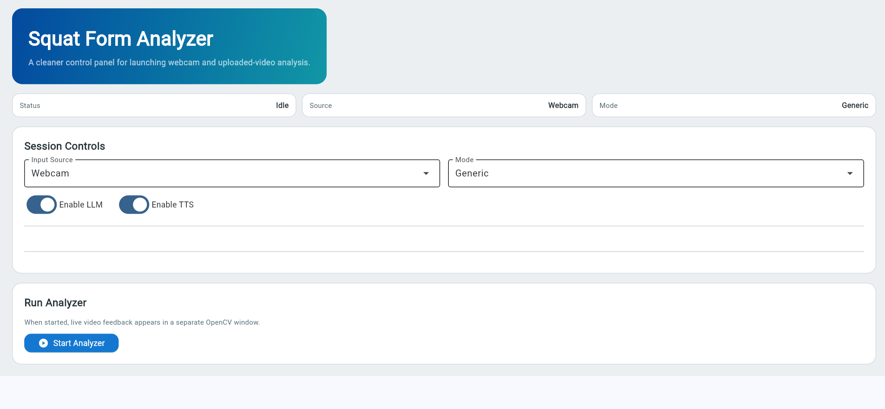
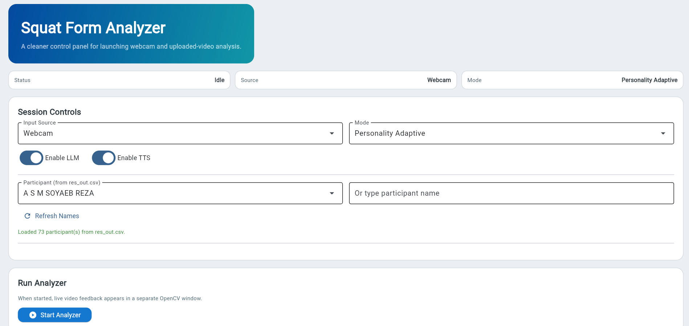
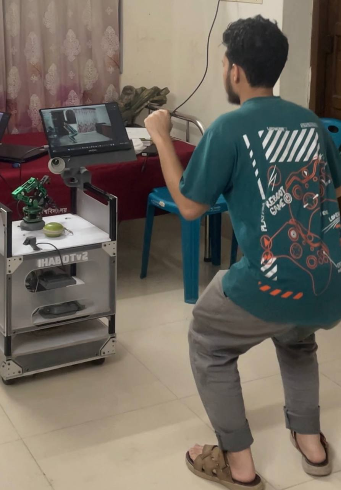
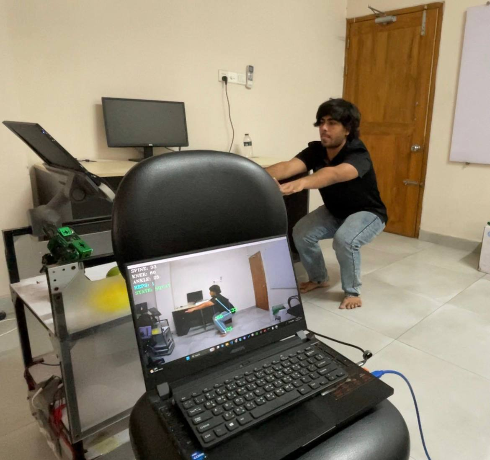

# Squat Form Analyzer with Feedback

Real-time squat form analysis using pose estimation, rule-based evaluation, and optional LLM-generated coaching feedback.

## Features

- Real-time squat tracking from webcam or uploaded video.
- Rep counting with posture-state transitions.
- Form checks for spine, knee, and ankle alignment.
- Rule-based coaching suggestions.
- Optional personality-adaptive feedback using Ollama.
- Optional text-to-speech playback for feedback.

## Project Structure

```
.
|-- app.py                  # Streamlit UI
|-- app_flet.py             # Flet UI
|-- main.py                 # Launch/entry glue
|-- config/
|   `-- settings.py         # Runtime settings and thresholds
|-- core/
|   |-- analyzer.py         # Main analysis loop
|   |-- evaluation.py       # Scoring and compliance logic
|   |-- geometry.py         # Angle/state calculations
|   `-- state.py            # Shared runtime state tracker
|-- data/
|   `-- personality.py      # Big Five data loading/helpers
|-- llm/
|   |-- client.py           # Ollama HTTP client
|   |-- feedback.py         # Prompt and feedback generation
|   `-- worker.py           # Background LLM worker queue
|-- models/
|   |-- model/
|   `-- Modelfile
|-- utils/
|   |-- drawing.py
|   `-- tts.py
`-- records/                # Session summary outputs
```

## Requirements

- Python 3.10+
- Webcam (for live mode)
- Ollama (optional, for LLM feedback)

## Installation

```bash
pip install -r requirements.txt
```

## Run

### Streamlit UI

```bash
streamlit run app.py
```

### Flet UI

```bash
flet run app_flet.py
```

### CLI Mode

```bash
python main.py
```

## How To Use

1. Install dependencies:

```bash
pip install -r requirements.txt
```

2. Start the app (Streamlit or Flet).
3. Choose input source:
- Webcam for live camera analysis.
- Upload Video for file-based analysis.
4. Choose mode:
- Generic: form feedback only.
- Personality Adaptive: uses participant Big Five profile for customized coaching tone/cues.
5. Optionally toggle:
- Enable LLM (Ollama text feedback)
- Enable TTS (spoken feedback)
6. Start analysis. The video and overlays are shown in an OpenCV window.
7. Perform reps and monitor the live angles, state, score, and suggestions.
8. Press `q` in the OpenCV window to end the session.

## How It Works

The analyzer uses MediaPipe pose landmarks to track shoulder, hip, knee, and ankle points.

For each frame it computes:
- Spine angle
- Knee angle
- Ankle angle

Knee-angle state transitions are used to detect squat phases:
- `s1`: Standing
- `s2`: Transition
- `s3`: Squat bottom

A full rep is counted when the sequence returns through the expected transition path and comes back to standing.

## Scoring System

Each rep is scored from three condition components in the range 0-1:
- Spine condition
- Knee condition
- Ankle condition

Final weighted score:

$$
	ext{score} = 0.45 \cdot \text{spine} + 0.35 \cdot \text{knee} + 0.20 \cdot \text{ankle}
$$

Issue detection rules currently include:
- Bend forward
- Bend backward
- Shallow squat
- Deep squat
- Knee crossing toe

Score color on display:
- Green: score >= 0.80
- Yellow: 0.50 <= score < 0.80
- Red: score < 0.50

The app also tracks compliance between consecutive reps by checking whether previous deviations decreased in the next rep.

## Feedback On Display

Feedback is shown in the OpenCV output window (not embedded directly in Streamlit/Flet video).

During analysis, overlays include:
- Live SPINE, KNEE, ANKLE angles
- Current rep count
- Current movement state (STANDING / TRANSITION / SQUAT)
- Suggestions panel after rep completion
- Rep score with color coding

Suggestions are shown primarily when the user returns to standing (`s1`), making cues visible between reps.

## Personality-Adaptive LLM + Spoken Feedback

When `Enable LLM` is on:
- Rep summaries are sent to an async worker queue.
- First LLM call happens after the first completed rep.
- Later calls are throttled by `LLM_INTERVAL_SECONDS` using the latest rep data.
- LLM returns short coaching cues.

When mode is `Personality Adaptive`:
- The prompt includes Big Five traits along with form metrics.
- Profiles are loaded from `res_out.csv` using `*_scaled` columns.
- Traits are mapped to 0-10 internally for display/config, then normalized in prompt context.

When `Enable TTS` is on:
- The latest LLM feedback is spoken asynchronously via `pyttsx3`.
- Speech is triggered when the user is standing, so spoken cues are delivered between reps.

## Session Output

- Console prints final session summary (reps, issues, compliance, average score, feedback timing).
- In personality-adaptive mode, a participant summary file is saved in `records/`.

## Configuration

Core runtime settings are in `config/settings.py`.

- Toggle LLM feedback.
- Toggle TTS output.
- Adjust thresholds/colors/window behavior.

## Media Placeholders


### Interface Images

<!-- Add interface screenshots below -->




### Demo Images

<!-- Add demo images below -->




### Demo Video

<!-- Add demo video link or embedded preview below -->


[![Watch demo]](demo-video.MOV)
Click the thumbnail to play the demo video:

Direct link: [Watch demo video](demo-video.MOV)

## Notes

- Personality-adaptive mode expects `res_out.csv` with the required scaled Big Five columns.
- Session summaries are written to `records/`.

## License

This project is licensed under the MIT License. See `LICENSE`.
